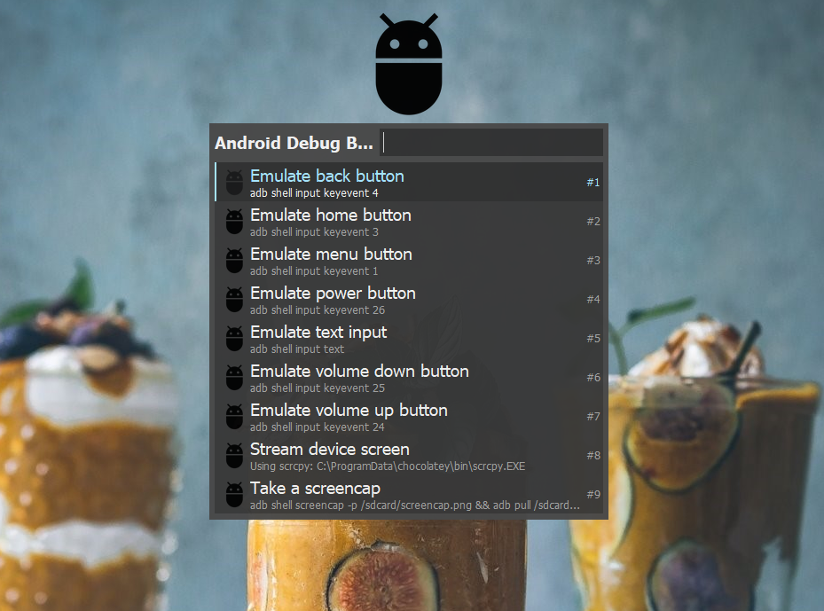

# Keypirinha ADB

This plugin extends [Keypirinha](http://keypirinha.com/) with several ADB snippets which Android developers may find useful.

## Usage

Use the `adb` catalog item to access snippets.

Snippets:
- Stream device screen (scrcpy)
- Emulate power button
- Emulate home button
- Emulate volume up button
- Emulate volume down button
- Emulate menu button
- Emulate back button
- Take a screencap
- Emulate text input
